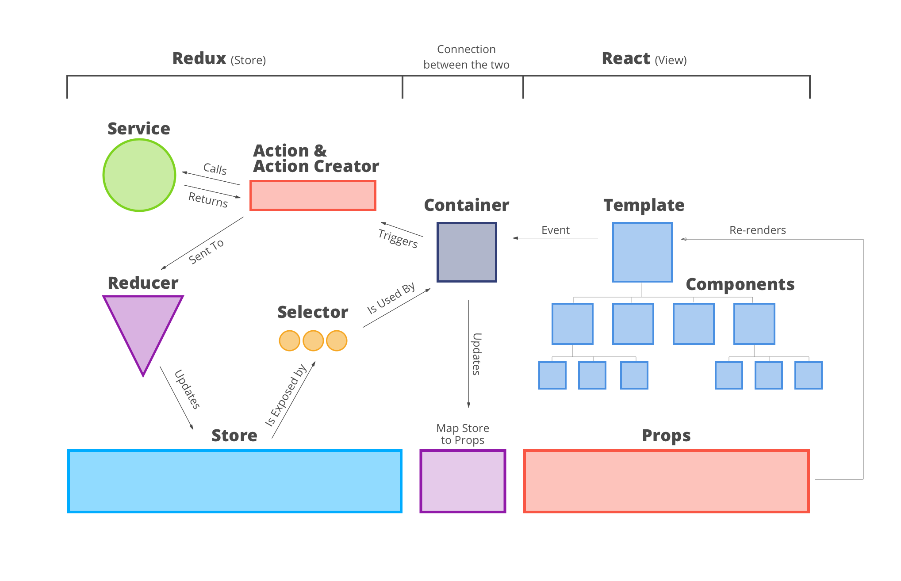

> # CODE OF CONDUCT **[STAYOLOGY](https://www.stayology.com)**
>
> [](http://standardjs.com)

---

> > ## Libraries and framework used for `Development`
>
> - [Typescript](https://www.typescriptlang.org/)
> - [Docker](https://www.docker.com/)
> - [Node JS](https://nodejs.org/en/)
> - [React](https://reactjs.org/)
> - [Redux](https://redux.js.org/)
> - [React Helmet](https://github.com/nfl/react-helmet)
> - [Rxjs](https://rxjs-dev.firebaseapp.com/)
> - [Immutable JS](https://immutable-js.github.io/immutable-js/)
>
> > ## UI Libraries
>
> - [Ant Design](https://ant.design/)
> - [React Spring](https://www.react-spring.io/)
> - [Less CSS](http://lesscss.org/)
> - [Normalize CSS](https://necolas.github.io/normalize.css/)
>
> > ## Redux middleware
>
> - [React Redux](https://react-redux.js.org/)
> - [Redux Observable](https://redux-observable.js.org/)
> - [Formik](https://jaredpalmer.com/formik/)
> - [Localforage](https://github.com/localForage/localForage)
> - [Typesafe Actions](https://github.com/piotrwitek/typesafe-actions)
> - [Reselect](https://github.com/reduxjs/reselect)
> - [React Router Dom](https://reacttraining.com/react-router/)
> - [Connected React Router](https://github.com/supasate/connected-react-router)
> - [Enquire JS](https://wicky.nillia.ms/enquire.js/)
>
> > ## Framework used for `Testing`
>
> - [Jest](https://jestjs.io/)
> - [React Testing Library](https://testing-library.com/)
> - [Cypress](https://www.cypress.io/)

---

> ## Versions In This Repository
>
> - [master](https://bitbucket.org/stayology/frontend/src/master/) - This is all of the current, released to production work
> - [develop](https://bitbucket.org/stayology/frontend/src/develop/) - This is the branch for the latest code merged after completion of one feature
> - [feature/any-feature] - all codes should be pushed to feature branch
>
> All PRs should be made to **develop**.

---

> ## Here are the list of **`linting`** tool
>
> **`typescript && javascript`** [eslint](https://eslint.org)
>
> After installing eslint check inside eslintrc.json for the rules
>
> **`css && less`** [stylelint](https://stylelint.io/)
>
> After installing stylelint check inside .stylelintrc.json for the rules
> **`editor layout`** [editorconfig](https://editorconfig.org)
>
> After installing editorconfig check inside .editorconfig for the rules
>
> For auto formating use [`prettier`](https://prettier.io/)

---

> ## **Component**
>
> ### Rules for creating `Component`
>
> 1. Always create component as **`functional component`**
> 2. If there is an need of an **`internal state`** use **`useState`** hooks to manage and set state and `state` should not be dependent on outside factor like `props, function parameter etc`
> 3. Use **`arrow function`** for creating functions and make sure there is a return type for functional component. ex:
>
>    - **`const FunctionalComponent: React.FC<IInterfaceProps> = (): React.ReactElement => {}`**
>
> 4. While including stylesheet, import `module based` stylesheet and there should not be any inline styling
>    - **`import style from 'components/some-component/style.module.less'`**
> 5. Try to write unit test cases for component including snapshot tests using `react-testing-library` and `jest`
>
> Every component should be build as functional component and should include an props interface type and should have two exports.
>
> - default export `export default ComponentName`
> - simple export `export const ComponentName = () => {...body}`
>
> Below is an example
>
> ```TypescriptReact
> import React, { useState } from 'react'
> import style from 'components/some-component/style.module.less'
>
> interface IFunctionalProps {
> 	height: number
> 	width: number
> }
>
> export const FunctionComponent: React.FC<IFunctionalProps> = (props) => {
> 	const [field, setField] = useState<string>("")
>
> 	const handleChange = (e: React.ChangeEvent<HTMLInputElement>) => {
> 		setField(e.target.value)
> 	}
>
> 	return (
> 		<div className={style.style_name}>
> 			<input type="text" onChange={handleChange} value={field} name="field">
> 		</div>
> 	)
> }
>
> export default FunctionComponent
> ```

---

> ## **Stylesheets**
>
> ### Rules for creating `stylesheets`
>
> 1. All stylesheet should be created as module based stylesheet and name should be same across all component stylesheet file `style.module.less`.
> 2. Use **`less`** and it's feature to do styling
>    - nesting of style rules
>    - use of variables
>    - use of macros

---

> ## Application working architecture 
>
> ---
>
> ## Application Integration Overview 
>
> `state` what I am talking about is all the data that is needed for the app to be in a particular…well state. State being the condition of a person or thing, as with respect to circumstances or attributes. This state is in the store for redux, and in the props for react. When the store is updated it re-maps through the container and re-renders the DOM. When there is an event in the DOM that triggers events through the container and to the Actions. The biggest thing to know here is that the store is where redux stores the data, the data is mapped to props, where React displays through components. And all that is state.

> Redux store the state value as immutable js object value and when it needs to connect with the frontend pages it makes use of `mapStateToProps` wigh the help of `selectors` which helps us in `memoization` and helps us recomputing the state value.
> Always extract only that amount of state data, what is needed on the pages container and store it into a seperate file. let's take an example :
>
> > we want to view user profile page and for that we need to extract few different states (redux global state) sub object and make it available into the container then it should look something like this as in folder view
> > `container > pages > profile` and inside profile folder there should be three files:
>
> - container.tsx
> - selector.ts
> - index.tsx
>
> > container is responsible for creating container with appropiate format and selector and making use of react-redux binding along with react-helmet for providing page metadata and finally in index.tsx make it loadable as lazy load for fast loading at commpile time.
> > find the below pages code design pattern: 
> > and one working example for this

```typescript
import React, { Component, Fragment } from 'react'
import { Helmet } from 'react-helmet'
import SigninScreen from 'containers/screens/signin'
import SignupScreen from 'containers/screens/signup'
import makeSelectionAuthPage from 'containers/pages/auth/selector'
import { initializeAuthAsync, fetchAuthLoginAsync } from 'libs/auth/action'
import { connect } from 'react-redux'
import injectReducer from 'utils/inject-reducer'
import authReducer from 'libs/auth/reducer'
import { compose } from 'redux'
import { epic$ } from 'store/rootEpic'
import authEpic from 'libs/auth/epic'
import { IPostLoginReq } from 'libs/auth/api'
import { withAppContext, IAppContext, setAuthToken } from 'containers/context/app'
import { IUser } from 'libs/user/state'

interface _IAuthProps {
	initialize: (value: boolean) => void
	login: (values: IPostLoginReq) => void
	user: IUser
	appContext: IAppContext
}
interface _IAuthState {
	signin: boolean
	signup: boolean
}

class AuthBase extends Component<_IAuthProps, _IAuthState> {
	readonly state = {
		signin: true,
		signup: false
	}

	componentDidMount = () => {
		epic$.next(authEpic)
		this.props.initialize(true)
	}

	componentDidUpdate = async (prevProps: _IAuthProps) => {
		if (!prevProps.user && Object.keys(this.props.user).length > 0 && this.props.user.token.length > 0) {
			await setAuthToken(this.props.user.token)
			this.props.appContext.setAuthenticated(true)
		}
	}

	showPage = (whichPage: string) => {
		if (whichPage == 'signin') {
			this.setState({
				signin: true,
				signup: false
			})
		} else {
			this.setState({
				signin: false,
				signup: true
			})
		}
	}

	onSignin = (values: IPostLoginReq) => {
		this.props.login(values)
	}

	render = () => {
		const { signin, signup } = this.state

		return (
			<Fragment>
				{/* this section is for header */}
				<Helmet>
					<meta charSet="utf-8" />
					<title>My Title</title>
					<link rel="canonical" href="http://mysite.com/example" />
				</Helmet>
				<div className={style.page_content}>
					{signin && <SigninScreen onSignin={this.onSignin} toggleScreen={this.showPage} />}
					{signup && <SignupScreen toggleScreen={this.showPage} />}
				</div>
			</Fragment>
		)
	}
}

const mapStateToProps = makeSelectionAuthPage
const mapDispatchToProps = {
	initialize: initializeAuthAsync.request,
	login: fetchAuthLoginAsync.request
}
const withConnect = connect(mapStateToProps, mapDispatchToProps)
const withReducer = injectReducer({ key: 'auth', reducer: authReducer })

export const Auth = compose(withReducer, withConnect, withAppContext)(AuthBase)

export default Auth
```
